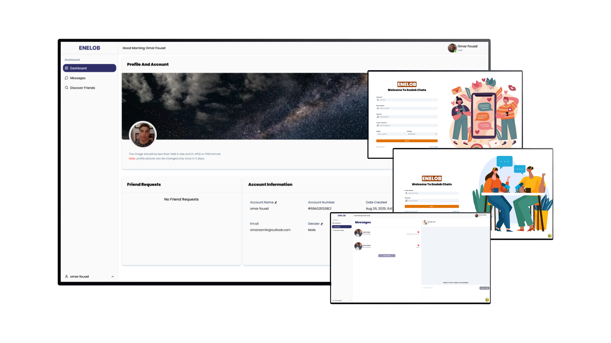

# ENELOB — Chats

**ENELOB** is a production-minded one-to-one chat application designed for reliability, low-latency UX, and scale.  
This document describes the full feature set (end-user and technical), the user flows starting from dashboard routes, the message & presence lifecycle, the asynchronous file-upload strategy using BullMQ + Redis, storage and persistence model, and deployment considerations (NGINX + Docker Compose).  
This is a companion PRD-style README to include in the repository.

---

## 📑 Table of contents

1. Overview
2. UX surface & dashboard routes
3. Core features (end-user) — exhaustive list
4. Realtime & message lifecycle (detailed flow)
5. Attachments: BullMQ + Redis upload flow (why & how)
6. Pagination, infinite scroll & search UX (debounce + filters)
7. Presence, seen receipts & optimistic UI behavior
8. Deployment & infra summary (Docker Compose, NGINX)
9. Running locally (what to configure, no code)
10. Monitoring, scaling & best practices
11. Troubleshooting & common pitfalls
12. Contributor notes & next steps

---

## 1. Overview

ENELOB is a private, lightweight chat product that focuses on:

- Fast one-to-one messaging with presence and read receipts.
- Non-blocking attachments: users see placeholder messages while files upload.
- Simple social features inside the dashboard: add/approve/decline/block friends; discover people.
- Scalable architecture:
  - **Next.js frontend**
  - **Express (TypeScript) backend**
  - **MongoDB** for persistence
  - **Redis** for caching/pub-sub and **BullMQ** queues for async uploads
  - **Socket.IO** for realtime messaging
  - **NGINX reverse proxy**, orchestrated via **Docker Compose**

---

## 2. UX surface & dashboard routes

The app is centered around a **Dashboard** experience. Primary routes:

- **`/login`** → Authentication (email + password).
- **`/register`** → User registration + profile setup.
- **`/dashboard`** → Dashboard main page for Profile and Cover pictures, friend requests, and user information.
- **`/dashboard/messages`** → Conversations list + active chat with infinite scroll & typing area.
- **`/dashboard/discover`** → Search, filter, and send friend requests.
- **Friend profile view** → Profile details, mutuals, and actions (message / add / block).

---

## 3. Core features (end-user)

### Messaging & Conversations

- One-to-one conversations.
- Text, image, and document messages.
- Delete conversation (soft-delete per side).
- Metadata: seen, sentAt, senderId.

### Presence & Realtime

- Online/offline presence.
- Private socket rooms (per user).
- Realtime updates only to conversation peers.

### Delivery & UX

- Optimistic UI (immediate local add).
- Placeholder messages for attachments.
- Read receipts on chat open/scroll.

### Attachments

- Async uploads with BullMQ + Redis workers.
- Placeholder → updated message after upload.
- Retry/failure flow with UI feedback.

### Social / Friends

- Send/approve/decline requests.
- Remove or block friends.
- View friend profiles.
- Discover/search users.

### Profile Management

- Update profile & cover images.
- Change display name, gender, birth date.

### Search & Filters

- Debounced type-ahead search.
- Filters: gender, name.
- Server pagination + filtering.

### Pagination

- Cursor-based infinite scroll (default limit=5).
- Next/Prev cursors for older/newer pages.
- Frontend flattens & groups messages.

---

## 4. Attachments: BullMQ + Redis

**Why**: Uploads are slow; async workers ensure fast responses, retries, and scalability.

**Flow**:

- Request → placeholder message → enqueue job.
- Worker uploads to Firebase → updates DB → emits update.
- Failures retried or marked as failed.

**Benefits**:

- Non-blocking UX.
- Reliable retries.
- Clean separation of responsibilities.

---

## 5. Pagination, infinite scroll & search

- Cursor-based pagination (`_id`).
- Infinite scroll (load older pages on scroll up).
- Debounced search (500ms).
- Filters (gender, name) applied server-side.

---

## 6. Presence, seen receipts & optimistic UI

- **Optimistic UI**: messages shown immediately; status updates on ack.
- **Seen receipts**: messages marked seen optimistically on view, persisted server-side.
- **Presence**: server broadcasts `userOnline/userOffline`; client Redux maintains state.

---

## 7. Deployment & infra summary

**Docker Compose services**

- `frontend` → Next.js
- `backend` → Express + Socket.IO
- `mongo` → MongoDB
- `redis` → Redis
- `worker` → BullMQ worker
- `nginx` → Reverse proxy (TLS termination, routing)

**NGINX responsibilities**

- `/` → frontend
- `/api` → backend
- `/socket.io` → backend (websocket upgrade)

**Scaling**

- Multiple backend/worker instances behind NGINX.
- Redis adapter for cross-node sockets.

---

## 8. Running locally

Required before running:

- MongoDB URI
- Redis URL
- JWT keys
- Firebase credentials (or S3 equivalent)
- Docker installed (for Compose)

Optional: Run Mongo & Redis locally instead of Docker.

---

## 9. Monitoring & best practices

- Monitor queues, job failures, socket connections.
- Use winston and winston daily for rotation
- Centralized logging with run timestaps.
- Autoscale workers by job backlog.

---

## 10. Troubleshooting

- **Multiple reconnects** → ensure single socket instance.
- **Messages broadcast globally** → use `io.to(userId)` not `io.emit`.
- **Large Mongo docs** → move to separate Message collection.
- **Uploads block responses** → enqueue instead of await.
- **Redis loss** → Mongo remains canonical source.

---

## 11. Contributor notes & next steps

- Open issues for bugs/features.
- Follow branch → PR workflow.
- Write tests before merging.
- Roadmap: group chats, push notifications, end-to-end encryption, media galleries.
